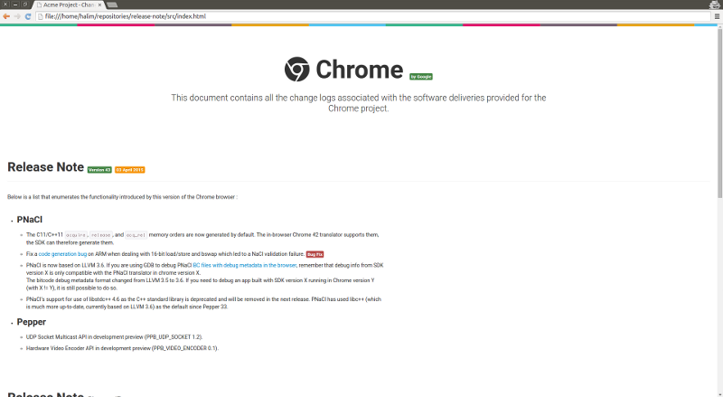

# Release note
> Beautiful, minimalist, and responsive release notes in the browser. See [demo here](https://hqarroum.github.io/release-note).

[](https://travis-ci.org/HQarroum/release-note)


Current version: **1.0.0**

Lead Maintainer: [Halim Qarroum](mailto:hqm.post@gmail.com)

<p align="center">
 
</p>

## Install

##### Using NPM

```bash
npm install --save release-note
```

## What's a release note ?

Release notes are documents that are distributed with software products, sometimes when the product is still in the development or test state (e.g., a beta release). For products that have already been in use by clients, the release note is delivered to the customer when an update is released. - [Wikipedia](https://en.wikipedia.org/wiki/Release_notes)

## What do I need it for ?

I actually use this format for communicating with third-party developers or clients about the changes involved in each version of the software I deliver, and I find it interesting to share it with anyone interested. The main reasons I use this release note format is :

 * I find it to be very user-friendly, and radically changes the perception of the *ugly-and-hard-to-read* release note found in the middle of a project.
 
* I like to separate components associated with the delivery with the actual project and its source when it is possible.

* Using an HTML rich document makes it also possible to embed a lot more semantic elements (both syntaxically and graphically) in the document to give more sense out of each release.

* This document does not rely on third-party resources and can be consulted offline, meaning that it does not require an Internet connectivity to be viewable. This comes in handy when the document is embedded in an application (desktop or mobile), or even on an embedded device.

This format is not suited for every use-case though, especially when an existing solution is available on the project/platform you are woking on/with. For instance using this format with open-source projects on Github may seem overkill since a single `CHANGELOG.md` might suffice.

## Guidelines

The main guidelines I apply to my self when editing the document are akin to those documented on [Keep a Changelog](http://keepachangelog.com/). The most important being :

 * Write for humans, not machines.
 * Easy to link to any section.
 * One sub-section per version.
 * List releases in reverse-chronological order (newest on top).
 * Write all dates in `YYYY-MM-DD` format. It’s international, sensible, and language-independent.
 * Explicitly mention whether the project follows [Semantic Versioning](http://semver.org/).
 * Each version should:
  * List its release date in the above format.
  * Group changes to describe their impact on the project, as follows:
   * Added for new features.
   * Changed for changes in existing functionality.
   * Deprecated for once-stable features removed in upcoming releases.
   * Removed for deprecated features removed in this release.
   * Fixed for any bug fixes.
   * Security to invite users to upgrade in case of vulnerabilities.
